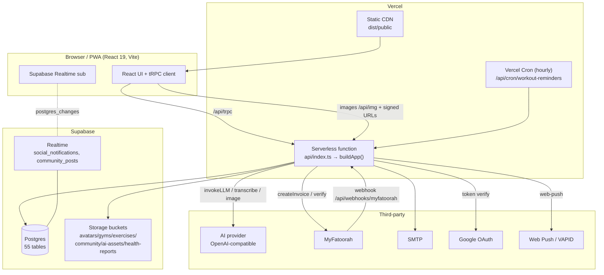

# Prime Fit — Phase 2 Migration Report (Manus → Standalone)

**Branch:** `migration/phase-2-standalone` · **Base:** `claude/manus-standalone-migration-maa8av`
**Stages 1–9 complete** (Stage 10 deploy is intentionally not done — needs your infra).
Every commit is `tsc`-clean, builds, and passes the test suite (147/149; the 2
failures are pre-existing env-presence checks for Google keys, unrelated to this work).

**Outcome:** the application no longer depends on the Manus platform for
anything at runtime. It targets **Vercel + Supabase** (Postgres + Storage +
Realtime) with a **vendor-agnostic AI provider**, and still runs as a single
self-hosted Node process if preferred.

---

## What changed, by stage

| Stage | Area | Before (Manus) | After (standalone) |
|---|---|---|---|
| 1 | Build tooling | vite-plugin-manus-runtime, jsx-loc, debug collector, Umami analytics | removed |
| 2 | Auth | Manus OAuth portal + SDK | JWT session + Google OAuth + email/password (Manus code deleted) |
| 3 | AI | `forge.manus.im` LLM, hard-coded model | `AiProvider` interface + OpenAI impl, all env-driven |
| 4 | Storage | Manus S3 presign proxy | Supabase Storage, 6 buckets, private health-reports, same `storagePut`/`storageGet` API |
| 5 | Database | MySQL/TiDB (drizzle mysql-core) | **PostgreSQL** (pg-core), postgres-js driver, fresh migration |
| 6 | Real-time | Socket.IO server + client | Supabase Realtime (postgres_changes) + automatic polling fallback |
| 7 | Misc APIs / cron | `notifyOwner` (Manus), per-user Heartbeat crons | SMTP owner alerts; one central Vercel Cron for reminders; dead dataApi/map removed |
| 8 | Runtime | long-running Express + Socket.IO | `buildApp()` factory + `api/index.ts` Vercel function + `vercel.json`; still self-hostable |
| 9 | Data | — | idempotent seed: 4 test accounts + demo content |

## Environment variables removed
`OAUTH_SERVER_URL`, `VITE_OAUTH_PORTAL_URL`, `BUILT_IN_FORGE_API_URL/KEY`,
`VITE_FRONTEND_FORGE_API_URL/KEY`, `VITE_ANALYTICS_ENDPOINT`, `VITE_ANALYTICS_WEBSITE_ID`.
See `ENVIRONMENT.md` for the full standalone set (added: Supabase, AI, `CRON_SECRET`, `OWNER_EMAIL`).

## Dependencies
- **Removed:** `mysql2`, `socket.io`, `socket.io-client`, the two Manus Vite plugins.
- **Added:** `postgres`, `@supabase/supabase-js`.

## Database port notes
- All 55 tables → `pg-core`; 34 uniquely-named `pgEnum` types; `serial` PKs;
  `numeric`/`doublePrecision`; `.onUpdateNow()` dropped (app sets `updatedAt`).
- Added unique constraints `user_follows(followerId,followingId)` and
  `community_bookmarks(userId,postId)` so Postgres upserts work.
- 21 MySQL insert-return/upsert sites converted to `.returning()` /
  `onConflictDoUpdate` / `onConflictDoNothing`.
- The 39 MySQL migrations were discarded; a single fresh Postgres migration is
  generated (`drizzle/0000_*.sql`). Runtime behavior is validated against a real
  Supabase DB at deploy — see blockers.

---

## Architecture (standalone)

Auth: email/password + Google both mint the same signed JWT session cookie
(`sdk.ts`). No external auth service required.

---

## Remaining blockers for deployment (all yours to provide)

1. **Supabase project** — connection string, URL, anon + service keys. Needed to
   apply the migration and to run the app. *This is also the only way to
   runtime-validate the Postgres port* (it's type-checked and the migration
   generates cleanly, but not yet executed against a live DB).
2. **Vercel** account + this repo connected (I have no Vercel access).
3. **API keys / accounts:** OpenAI, Google OAuth test client, MyFatoorah sandbox,
   SMTP, VAPID.
4. **Supabase setup steps** that aren't code: create the 6 storage buckets, mark
   `health-reports` private, and enable Realtime on `social_notifications` +
   `community_posts` (see `DEPLOYMENT_GUIDE.md`).

## Known limitations / follow-ups (non-blocking)
- **Rate limiting** is in-memory (`express-rate-limit`); on Vercel it resets per
  cold start and isn't shared across instances. Move to Upstash/Supabase-backed
  store for real enforcement.
- **Static app images**: legacy `/manus-storage/*` URLs are rewritten to
  `/api/img/*` (Supabase-backed). A fresh staging DB has no such rows; built-in
  images ship in `client/public/` and serve from the CDN.
- **Reminder cron granularity**: **daily** (`0 6 * * *`) on Vercel Hobby, which
  caps crons at once/day — so the reminder job matches only users whose reminder
  hour is 06:00 UTC. Hourly granularity (matching every user's hour) requires the
  Vercel **Pro** plan; switch `vercel.json` back to `0 * * * *` after upgrading.
- Historical "manus" strings remain only in comments, test fixtures, a
  localStorage key name, and the legacy image-URL map — no runtime dependency.
- The DB port did not migrate production data (staging is a fresh seed, by
  design). A production data migration (MySQL→Postgres) is a separate plan.

## Verification performed
- `tsc --noEmit` clean and `pnpm build` (client + server) green after every stage.
- `pnpm test`: 147/149 (2 pre-existing env-only).
- `drizzle-kit generate` produces a valid Postgres migration (enums, serial,
  unique constraints).
- Full-repo grep confirms no runtime Manus/forge/socket.io/mysql references.

See `DEPLOYMENT_GUIDE.md`, `ENVIRONMENT.md`, `INFRASTRUCTURE_CHECKLIST.md`, and
`SMOKE_TEST.md` for the operational runbook.
