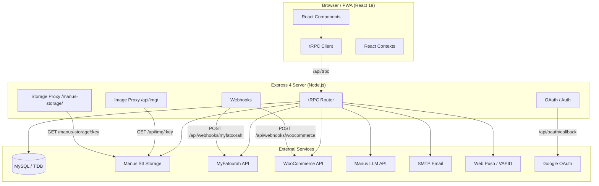
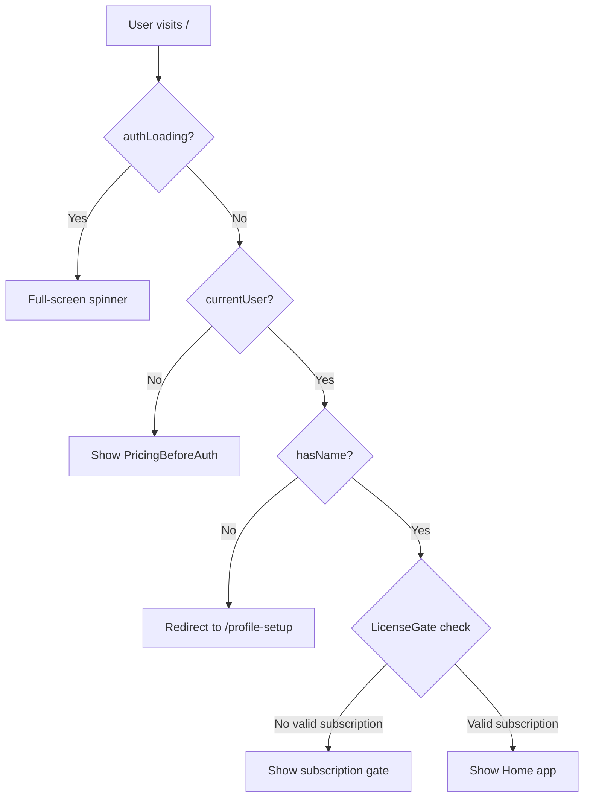
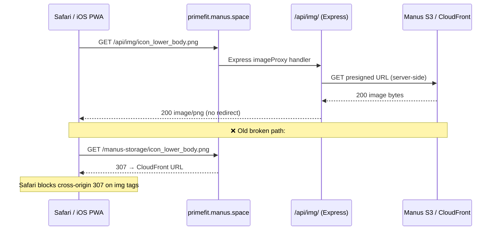
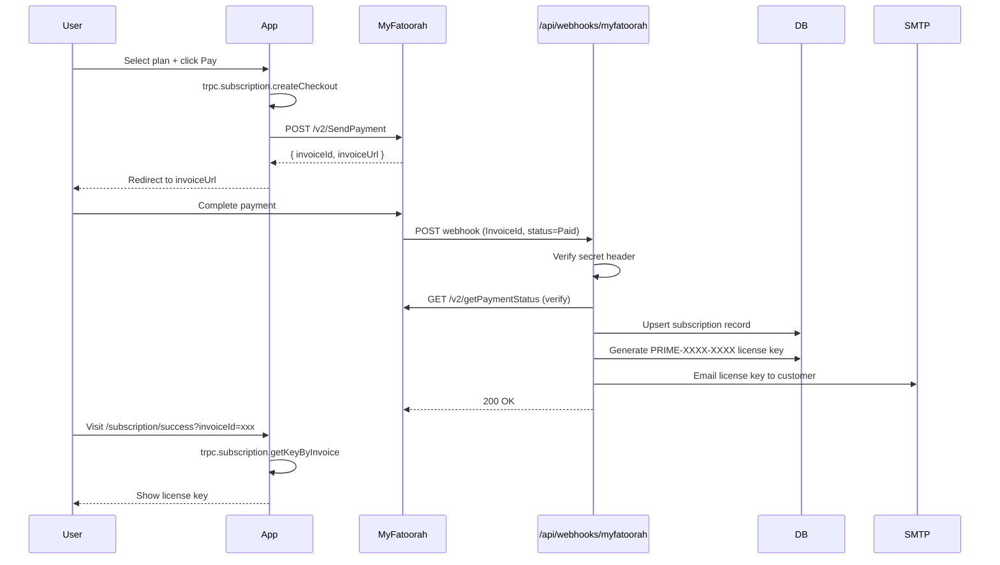

# Prime Fit — Architecture

## High-Level Architecture

Prime Fit is a **monorepo full-stack web application** with a React 19 frontend and an Express 4 backend, communicating exclusively via tRPC 11. The entire codebase lives in a single repository under `/home/ubuntu/workout-plan/`.



---

## Frontend Architecture

The frontend is a **React 19 single-page application** built with Vite 7. It uses **Tailwind CSS 4** for styling and **shadcn/ui** (Radix UI primitives) for accessible component primitives.

### Routing

Routing is handled by **wouter** (a lightweight React router). Routes are defined in `client/src/App.tsx`:

| Path | Component | Auth Required |
|------|-----------|---------------|
| `/` | `Home` | Yes (via LicenseGate) |
| `/admin` | `AdminPanel` | Admin role |
| `/pricing` | `Pricing` | No |
| `/subscription/success` | `SubscriptionResult` | No |
| `/subscription/error` | `SubscriptionResult` | No |
| `/reset-password` | `ResetPasswordPage` | No |
| `/profile-setup` | `ProfileSetupPage` | Yes (logged in) |
| `/privacy` | `LegalPage` | No |
| `/terms` | `LegalPage` | No |

### Authentication Flow in Frontend



### Context Providers (in order, outermost first)

| Provider | File | Purpose |
|----------|------|---------|
| `ErrorBoundary` | `components/ErrorBoundary.tsx` | Catches React render errors |
| `ThemeProvider` | `contexts/ThemeContext.tsx` | Light/dark theme (defaults to light) |
| `LanguageProvider` | `contexts/LanguageContext.tsx` | Arabic/English toggle, RTL/LTR |
| `trpc.Provider` | `main.tsx` | tRPC client instance |
| `QueryClientProvider` | `main.tsx` | React Query cache |
| `SocketProvider` | `contexts/SocketContext.tsx` | Socket.IO real-time connection |
| `SubscriptionProvider` | `contexts/SubscriptionContext.tsx` | Current user subscription state |
| `CMSProvider` | `contexts/CMSContext.tsx` | CMS overrides (icons, exercise images) |

### State Management

There is **no global state library** (no Redux, no Zustand). State is managed through:

- **tRPC + React Query** for all server state (queries and mutations)
- **React Context** for cross-cutting concerns (language, theme, subscription, CMS)
- **localStorage** for client-only persistence (workout sessions, profile, language preference, PWA install flag)
- **`useGymTracker` hook** (`hooks/useGymTracker.ts`) — the primary workout state machine, persists to localStorage

---

## Backend Architecture

The backend is an **Express 4 server** with tRPC 11 mounted at `/api/trpc`. It is written in TypeScript and compiled with `esbuild` for production.

### Server Entry Point

`server/_core/index.ts` bootstraps the entire server:

1. Loads environment variables via `dotenv`
2. Creates Express app with `helmet` (security headers) and rate limiters
3. Registers OAuth routes (`/api/oauth/*`)
4. Registers storage proxy (`/manus-storage/*`)
5. Registers image proxy (`/api/img/*`)
6. Registers tRPC middleware at `/api/trpc`
7. Registers webhook handlers (`/api/webhooks/*`)
8. Registers Google OAuth routes
9. Sets up Socket.IO on the HTTP server
10. Serves static frontend files (Vite in dev, `dist/` in production)

### tRPC Router Tree

```
appRouter
├── system          (systemRouter — owner notifications)
├── auth
│   ├── me          (publicProcedure — returns current user)
│   └── logout      (publicProcedure — clears session cookie)
├── license         (licenseRouter)
├── notifications   (notificationsRouter)
├── coach           (coachRouter — AI chat)
├── community       (communityRouter)
├── admin           (adminRouter)
├── subscription    (subscriptionRouter)
├── userProfile     (userProfileRouter)
├── spinWheel       (spinWheelRouter)
├── nutrition       (nutritionRouter)
├── standaloneAuth  (standaloneAuthRouter — email/password auth)
├── workout         (workoutRouter)
├── exerciseFavorites (exerciseFavoritesRouter)
├── gymClasses      (gymClassesRouter)
└── cms             (cmsRouter)
```

### Procedure Types

| Type | File | Description |
|------|------|-------------|
| `publicProcedure` | `server/_core/trpc.ts` | No auth required |
| `protectedProcedure` | `server/_core/trpc.ts` | Requires valid session cookie |
| `adminProcedure` | `server/_core/trpc.ts` | Requires `role === 'admin'` |

---

## Folder Structure

```
workout-plan/
├── client/
│   ├── public/              ← Small config files ONLY (manifest.json, favicon)
│   │   └── images/          ← Local copies of images (NOT deployed — CDN is source of truth)
│   └── src/
│       ├── _core/hooks/     ← useAuth.ts
│       ├── components/      ← Reusable UI components
│       │   └── ui/          ← shadcn/ui primitives
│       ├── contexts/        ← React contexts
│       ├── data/            ← Static exercise/workout data (large TS files)
│       ├── hooks/           ← Custom React hooks
│       ├── lib/             ← Utilities (imageUtils, calorieCalc, exerciseData, etc.)
│       ├── pages/           ← Page-level components
│       ├── App.tsx          ← Router + auth guard
│       ├── const.ts         ← Frontend constants (getLoginUrl, etc.)
│       ├── index.css        ← Global Tailwind + CSS variables
│       └── main.tsx         ← App entry point + tRPC/QueryClient setup
├── drizzle/
│   ├── schema.ts            ← All table definitions (source of truth)
│   ├── relations.ts         ← Drizzle ORM relations
│   └── migrations/          ← Auto-generated migration files
├── handoff/                 ← This documentation folder
├── server/
│   ├── _core/               ← Framework plumbing (DO NOT edit casually)
│   │   ├── context.ts       ← tRPC context (injects ctx.user)
│   │   ├── email.ts         ← SMTP email helpers
│   │   ├── env.ts           ← All environment variable bindings
│   │   ├── imageProxy.ts    ← /api/img/ proxy (Safari fix)
│   │   ├── index.ts         ← Server entry point
│   │   ├── llm.ts           ← invokeLLM() helper
│   │   ├── myfatoorah.ts    ← MyFatoorah API client
│   │   ├── notification.ts  ← notifyOwner() helper
│   │   ├── oauth.ts         ← Manus OAuth flow
│   │   ├── storageProxy.ts  ← /manus-storage/ proxy (dev server)
│   │   ├── trpc.ts          ← tRPC instance + procedure types
│   │   └── vite.ts          ← Vite dev server bridge
│   ├── handlers/            ← Non-tRPC request handlers
│   │   ├── googleOAuth.ts
│   │   ├── licenseUtils.ts
│   │   ├── myfatoorahWebhook.ts
│   │   ├── wooCommerceWebhook.ts
│   │   ├── wooPoller.ts
│   │   └── workoutReminder.ts
│   ├── routers/             ← Feature tRPC routers
│   ├── db.ts                ← Query helpers
│   ├── index.ts             ← Re-exports server entry
│   ├── routers.ts           ← Root router assembly
│   └── storage.ts           ← S3 storagePut/storageGet helpers
├── shared/
│   ├── const.ts             ← Shared constants (COOKIE_NAME, error messages)
│   └── types.ts             ← Shared TypeScript types
├── package.json
├── vite.config.ts
├── drizzle.config.ts
├── vitest.config.ts
└── todo.md
```

---

## Authentication

Prime Fit uses **two parallel authentication systems**:

### 1. Manus OAuth (Primary)
- Handled by `server/_core/oauth.ts`
- Flow: frontend calls `getLoginUrl()` → redirects to Manus OAuth portal → callback at `/api/oauth/callback` → JWT session cookie set
- Session cookie name: `prime_fit_session` (defined in `shared/const.ts` as `COOKIE_NAME`)
- Cookie is HTTP-only, signed with `JWT_SECRET`
- `ctx.user` is injected into every tRPC context via `server/_core/context.ts`

### 2. Standalone Email/Password Auth
- Handled by `server/routers/standaloneAuth.ts`
- Bcrypt password hashing
- Same JWT session cookie as OAuth
- Supports: register, login, forgot-password (email OTP), reset-password
- Rate limited: 10 login attempts / 15 min, 5 signups / hour, 3 forgot-password / hour

### 3. Google OAuth
- Handled by `server/handlers/googleOAuth.ts`
- Routes: `GET /api/auth/google` → `GET /api/auth/google/callback`
- Google users always have a name from OAuth — never redirected to profile setup

---

## Database

- **Engine:** MySQL 8 / TiDB (compatible)
- **ORM:** Drizzle ORM 0.44
- **Connection:** `DATABASE_URL` environment variable (MySQL connection string)
- **Migrations:** `pnpm db:push` runs `drizzle-kit generate && drizzle-kit migrate`
- **Schema file:** `drizzle/schema.ts` — single source of truth for all tables

See `DATABASE.md` for full table documentation.

---

## Storage

All file storage uses **Manus S3-compatible storage** via the `storagePut` / `storageGet` helpers in `server/storage.ts`.

Files are stored with keys like `gym-logos/gym_30001_abc123.png` and served via:
- **Development:** `/manus-storage/:key` → `storageProxy.ts` pipes bytes directly
- **Production:** `/api/img/:key` → `imageProxy.ts` fetches from S3 and pipes bytes

**Critical rule:** All image `src` values in React components **must** pass through `resolveImageUrl()` from `client/src/lib/imageUtils.ts`. This rewrites `/manus-storage/` paths to `/api/img/` paths, which bypasses the platform CDN's 307 redirect that Safari blocks.

---

## Image Serving Architecture



---

## Payments (MyFatoorah)



---

## Real-time (Socket.IO)

Socket.IO is mounted on the same HTTP server as Express. The singleton is exported via `getIO()` from `server/_core/index.ts`. The frontend connects via `contexts/SocketContext.tsx`. Currently used for real-time community feed updates and live notifications.

---

## AI Integrations

| Integration | Helper | Used In |
|-------------|--------|---------|
| LLM chat | `server/_core/llm.ts` → `invokeLLM()` | AI Coach (`routers/coach.ts`) |
| Food photo analysis | `server/_core/foodAnalysis.ts` | Nutrition (`routers/nutrition.ts`) |
| Image generation | `server/_core/imageGeneration.ts` | Not currently used in UI |
| Voice transcription | `server/_core/voiceTranscription.ts` | Not currently used in UI |

All AI calls use the Manus built-in LLM proxy (`BUILT_IN_FORGE_API_URL` / `BUILT_IN_FORGE_API_KEY`). No OpenAI API key is needed.

---

## Third-Party Integrations

| Service | Purpose | Config |
|---------|---------|--------|
| MyFatoorah | Payment gateway (Kuwait) | `MYFATOORAH_API_KEY`, `MYFATOORAH_API_URL`, `MYFATOORAH_WEBHOOK_SECRET` |
| WooCommerce | Legacy order webhook | `WOO_STORE_URL`, `WOO_CONSUMER_KEY`, `WOO_CONSUMER_SECRET`, `WOO_WEBHOOK_SECRET` |
| Google OAuth | Social login | `VITE_GOOGLE_CLIENT_ID`, `GOOGLE_CLIENT_SECRET` |
| SMTP (Gmail) | Transactional email | `SMTP_HOST`, `SMTP_PORT`, `SMTP_USER`, `SMTP_PASS`, `SMTP_FROM` |
| Web Push (VAPID) | Browser push notifications | `VAPID_PUBLIC_KEY`, `VAPID_PRIVATE_KEY` |
| Manus OAuth | Primary auth | `VITE_APP_ID`, `OAUTH_SERVER_URL`, `VITE_OAUTH_PORTAL_URL` |
| Manus S3 | File storage | `BUILT_IN_FORGE_API_URL`, `BUILT_IN_FORGE_API_KEY` |
| Manus LLM | AI features | Same as S3 (same Forge API) |
| USDA FoodData Central | Nutrition database | No API key (public API) |
