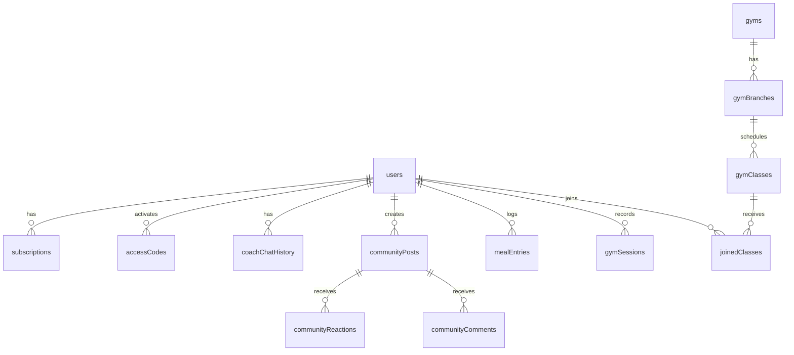

# Prime Fit — Database Reference

## Overview

- **Engine:** MySQL 8 / TiDB (MySQL-compatible)
- **ORM:** Drizzle ORM 0.44
- **Schema file:** `drizzle/schema.ts` — single source of truth
- **Migration command:** `pnpm db:push` (runs `drizzle-kit generate && drizzle-kit migrate`)
- **Connection:** `DATABASE_URL` environment variable

The database contains **54 tables** across the following domains: Users & Auth, Notifications, AI Coach, Community, Subscriptions & Billing, Nutrition, Workouts, Admin, CMS, and Gym Classes.

---

## Domain Map

---

## Table Reference

### `users`
Primary user accounts table. Supports both Manus OAuth and standalone email/password auth.

| Column | Type | Notes |
|--------|------|-------|
| `id` | int PK autoincrement | Internal numeric ID |
| `openId` | varchar(255) unique | Manus OAuth subject identifier |
| `name` | varchar(255) | Display name |
| `fullName` | varchar(255) | Full name (used to detect new users needing profile setup) |
| `email` | varchar(255) unique | Email address |
| `passwordHash` | varchar(255) | Bcrypt hash (null for OAuth users) |
| `role` | enum('admin','user') | Default 'user' |
| `avatarUrl` | text | Profile picture URL |
| `gender` | enum('male','female') | Used for workout program selection |
| `age` | int | |
| `height` | int | cm |
| `currentWeight` | decimal(5,2) | kg |
| `targetWeight` | decimal(5,2) | kg |
| `activityLevel` | varchar(50) | 'sedentary','lightly_active','moderately_active','very_active','extra_active' |
| `loginMethod` | varchar(50) | 'manus','email','google' |
| `authProvider` | varchar(50) | 'manus','standalone','google' |
| `resetToken` | varchar(255) | Password reset OTP |
| `resetTokenExpiry` | timestamp | OTP expiry |
| `xp` | int default 0 | Experience points |
| `level` | int default 1 | Computed from XP |
| `streak` | int default 0 | Current workout streak (days) |
| `lastWorkoutDate` | varchar(10) | YYYY-MM-DD of last workout |
| `bio` | text | Profile bio |
| `isActive` | boolean default true | Account active flag |
| `createdAt` | timestamp | |
| `updatedAt` | timestamp onUpdateNow | |

---

### `accessCodes`
License keys in PRIME-XXXX-XXXX format. Generated on payment or manually by admin.

| Column | Type | Notes |
|--------|------|-------|
| `id` | int PK | |
| `code` | varchar(50) unique | PRIME-XXXX-XXXX format |
| `customerName` | varchar(255) | |
| `customerEmail` | varchar(255) | Used to match returning customers |
| `note` | text | Admin notes or auto-generated note |
| `isActive` | boolean default true | |
| `expiresAt` | timestamp | null = never expires |
| `createdAt` | timestamp | |
| `updatedAt` | timestamp | |

---

### `pushSubscriptions`
Web Push (VAPID) subscription endpoints per device.

| Column | Type | Notes |
|--------|------|-------|
| `id` | int PK | |
| `userId` | int | FK → users.id |
| `endpoint` | text | Push endpoint URL |
| `p256dh` | text | Public key |
| `auth` | text | Auth secret |
| `createdAt` | timestamp | |

---

### `notificationSettings`
Per-user notification preferences.

| Column | Type | Notes |
|--------|------|-------|
| `id` | int PK | |
| `userId` | int unique | FK → users.id |
| `workoutReminders` | boolean default true | |
| `communityNotifs` | boolean default true | |
| `achievementNotifs` | boolean default true | |
| `emailNotifs` | boolean default true | |
| `updatedAt` | timestamp | |

---

### `coachChatHistory`
AI coach conversation history. One row per message.

| Column | Type | Notes |
|--------|------|-------|
| `id` | int PK | |
| `userId` | int | FK → users.id |
| `role` | enum('user','assistant') | |
| `content` | text | Message content |
| `createdAt` | timestamp | |

---

### `coachCheckins`
Daily wellness check-ins (mood, energy, sleep) with AI response.

| Column | Type | Notes |
|--------|------|-------|
| `id` | int PK | |
| `userId` | int | |
| `date` | varchar(10) | YYYY-MM-DD |
| `feeling` | int | 1–5 scale |
| `energy` | int | 1–5 scale |
| `sleep` | int | 1–5 scale |
| `aiResponse` | text | AI-generated coaching response |
| `createdAt` | timestamp | |

---

### `coachInsights`
AI-generated coaching feedback cards shown to users.

| Column | Type | Notes |
|--------|------|-------|
| `id` | int PK | |
| `userId` | int | |
| `type` | varchar(32) | 'progress','warning','motivation','recommendation' |
| `content` | text | Arabic content |
| `contentEn` | text | English content |
| `createdAt` | timestamp | |

---

### `coachMemory`
Persistent AI coach context per user. One row per user.

| Column | Type | Notes |
|--------|------|-------|
| `id` | int PK | |
| `userId` | int unique | |
| `goalWeight` | int | |
| `currentWeight` | int | |
| `preferredLanguage` | varchar(8) default 'ar' | |
| `notes` | text | JSON blob for extra context |
| `updatedAt` | timestamp | |

---

### `communityPosts`
Social feed posts.

| Column | Type | Notes |
|--------|------|-------|
| `id` | int PK | |
| `userId` | int | |
| `type` | enum('text','image','achievement','transformation','auto') | |
| `content` | text | Arabic content |
| `contentEn` | text | English content |
| `imageUrl` | text | S3 URL |
| `imageKey` | text | S3 key |
| `visibility` | enum('public','friends','private') | |
| `xpAwarded` | int default 0 | |
| `likesCount` | int default 0 | Denormalized counter |
| `commentsCount` | int default 0 | Denormalized counter |
| `isTrending` | boolean default false | |
| `isPinned` | boolean default false | |
| `isHidden` | boolean default false | Admin moderation |
| `createdAt` | timestamp | |

---

### `communityReactions`
Post reactions (like, cheer, fire).

| Column | Type | Notes |
|--------|------|-------|
| `id` | int PK | |
| `postId` | int | FK → communityPosts.id |
| `userId` | int | |
| `type` | enum('like','cheer','fire') | |
| `createdAt` | timestamp | |

---

### `communityComments`
Post comments.

| Column | Type | Notes |
|--------|------|-------|
| `id` | int PK | |
| `postId` | int | |
| `userId` | int | |
| `content` | text | |
| `createdAt` | timestamp | |

---

### `communityStories`
24-hour ephemeral stories (Instagram-style).

| Column | Type | Notes |
|--------|------|-------|
| `id` | int PK | |
| `userId` | int | |
| `mediaUrl` | text | |
| `mediaKey` | text | |
| `expiresAt` | timestamp | 24h after creation |
| `createdAt` | timestamp | |

---

### `communityChallenges`
Community fitness challenges with spin wheel rewards.

| Column | Type | Notes |
|--------|------|-------|
| `id` | int PK | |
| `title` | varchar(255) | |
| `titleAr` | varchar(255) | |
| `description` | text | |
| `descriptionAr` | text | |
| `type` | varchar(50) | 'workout','steps','weight_loss', etc. |
| `targetValue` | int | |
| `unit` | varchar(50) | |
| `startDate` | timestamp | |
| `endDate` | timestamp | |
| `isActive` | boolean | |
| `spinWheelEnabled` | boolean | |
| `createdAt` | timestamp | |

---

### `challengeParticipants`
User participation in challenges.

| Column | Type | Notes |
|--------|------|-------|
| `id` | int PK | |
| `challengeId` | int | |
| `userId` | int | |
| `progress` | int default 0 | |
| `completed` | boolean default false | |
| `joinedAt` | timestamp | |

---

### `socialNotifications`
In-app social notifications (likes, comments, follows, mentions).

| Column | Type | Notes |
|--------|------|-------|
| `id` | int PK | |
| `userId` | int | Recipient |
| `fromUserId` | int | Sender |
| `type` | varchar(50) | 'like','comment','follow','mention','achievement' |
| `postId` | int | Optional |
| `message` | text | |
| `isRead` | boolean default false | |
| `createdAt` | timestamp | |

---

### `userPrivacySettings`
Per-user privacy preferences.

| Column | Type | Notes |
|--------|------|-------|
| `id` | int PK | |
| `userId` | int unique | |
| `profileVisibility` | enum('public','friends','private') | |
| `showWeight` | boolean | |
| `showStreak` | boolean | |
| `showWorkouts` | boolean | |
| `allowMessages` | boolean | |
| `updatedAt` | timestamp | |

---

### `communityXpLog`
XP transaction log for community actions.

| Column | Type | Notes |
|--------|------|-------|
| `id` | int PK | |
| `userId` | int | |
| `amount` | int | XP delta |
| `reason` | varchar(255) | 'post','comment','like','challenge', etc. |
| `createdAt` | timestamp | |

---

### `adminProfile`
Single-row admin configuration table.

| Column | Type | Notes |
|--------|------|-------|
| `id` | int PK | |
| `ownerName` | varchar(255) | |
| `ownerEmail` | varchar(255) | |
| `appName` | varchar(255) | |
| `updatedAt` | timestamp | |

---

### `broadcastNotifications`
Admin-sent notifications to users (in-app popup, email, or both).

| Column | Type | Notes |
|--------|------|-------|
| `id` | int PK | |
| `title` | varchar(255) | |
| `message` | text | |
| `imageUrl` | text | Optional banner |
| `ctaText` | varchar(255) | Call-to-action button text |
| `ctaUrl` | text | Call-to-action link |
| `targetType` | enum('all','active_subscribers','new_subscribers','specific_users') | |
| `targetUserIds` | text | JSON array of user IDs (for specific_users) |
| `sendInApp` | boolean default true | |
| `sendEmail` | boolean default false | |
| `sentAt` | timestamp | |
| `createdAt` | timestamp | |

---

### `notificationReads`
Tracks which users have read which broadcast notifications.

| Column | Type | Notes |
|--------|------|-------|
| `id` | int PK | |
| `notificationId` | int | FK → broadcastNotifications.id |
| `userId` | int | |
| `isRead` | boolean default false | |
| `readAt` | timestamp | |

---

### `adminNotifications`
Owner-facing operational alerts (sent via `notifyOwner()`).

| Column | Type | Notes |
|--------|------|-------|
| `id` | int PK | |
| `title` | varchar(255) | |
| `content` | text | |
| `isRead` | boolean default false | |
| `createdAt` | timestamp | |

---

### `subscriptions`
Current subscription state per user.

| Column | Type | Notes |
|--------|------|-------|
| `id` | int PK | |
| `userId` | varchar(255) | Manus openId |
| `plan` | enum('free','prime_plus','prime_pro') | |
| `status` | enum('active','trialing','expired','cancelled','pending') | |
| `period` | enum('monthly','yearly','free_trial') | |
| `paymentStatus` | varchar(50) | 'paid','free','pending','failed' |
| `paymentProvider` | varchar(50) | 'myfatoorah','woocommerce','free' |
| `startsAt` | timestamp | |
| `expiresAt` | timestamp | |
| `invoiceId` | varchar(255) | MyFatoorah invoice ID |
| `licenseKey` | varchar(50) | PRIME-XXXX-XXXX |
| `email` | varchar(255) | Customer email at time of payment |
| `createdAt` | timestamp | |
| `updatedAt` | timestamp | |

---

### `billingHistory`
Immutable payment transaction log.

| Column | Type | Notes |
|--------|------|-------|
| `id` | int PK | |
| `userId` | varchar(255) | |
| `plan` | varchar(50) | |
| `period` | varchar(50) | |
| `amount` | varchar(20) | String to preserve decimal precision |
| `currency` | varchar(10) | 'KWD' |
| `status` | enum('pending','paid','failed','refunded') | |
| `invoiceId` | varchar(255) | |
| `paymentRef` | varchar(255) | MyFatoorah transaction ID |
| `createdAt` | timestamp | |

---

### `postMentions`
@mention tracking in community posts.

| Column | Type | Notes |
|--------|------|-------|
| `id` | int PK | |
| `postId` | int | |
| `mentionedUserId` | int | |
| `createdAt` | timestamp | |

---

### `rewardProbabilities`
Spin wheel reward catalog with weighted probabilities.

| Column | Type | Notes |
|--------|------|-------|
| `id` | int PK | |
| `name` | varchar(255) | English name |
| `nameAr` | varchar(255) | Arabic name |
| `type` | enum('premium_days','xp_bonus','badge','ai_boost','streak_protection','upgrade','ai_insights','workout_unlock') | |
| `rarity` | enum('common','uncommon','rare','jackpot') | |
| `weight` | int | Higher = more likely |
| `value` | int | Days, XP amount, etc. |
| `icon` | varchar(10) | Emoji (legacy — UI uses SVG) |
| `color` | varchar(20) | Hex color |
| `isActive` | boolean default true | |

---

### `rewardSpins`
Individual spin events.

| Column | Type | Notes |
|--------|------|-------|
| `id` | int PK | |
| `userId` | int | |
| `challengeId` | int | |
| `rewardId` | int | FK → rewardProbabilities.id |
| `rewardType` | varchar(50) | |
| `rewardValue` | int | |
| `spunAt` | timestamp | |

---

### `rewardHistory`
Applied rewards (after spin is claimed).

| Column | Type | Notes |
|--------|------|-------|
| `id` | int PK | |
| `userId` | int | |
| `spinId` | int | FK → rewardSpins.id |
| `rewardType` | varchar(50) | |
| `rewardValue` | int | |
| `appliedAt` | timestamp | |
| `expiresAt` | timestamp | |

---

### `challengeRewards`
Per-challenge reward weight overrides.

| Column | Type | Notes |
|--------|------|-------|
| `id` | int PK | |
| `challengeId` | int | |
| `rewardId` | int | |
| `weightOverride` | int | Overrides rewardProbabilities.weight |

---

### `jackpotWinners`
Jackpot win records for display.

| Column | Type | Notes |
|--------|------|-------|
| `id` | int PK | |
| `userId` | int | |
| `rewardId` | int | |
| `wonAt` | timestamp | |

---

### `nutritionGoals`
Per-user daily nutrition targets. One row per user.

| Column | Type | Notes |
|--------|------|-------|
| `id` | int PK | |
| `userId` | int unique | |
| `calories` | int | kcal/day |
| `protein` | int | grams |
| `carbs` | int | grams |
| `fat` | int | grams |
| `water` | int | ml/day |
| `updatedAt` | timestamp | |

---

### `mealEntries`
Individual food items logged per meal.

| Column | Type | Notes |
|--------|------|-------|
| `id` | int PK | |
| `userId` | int | |
| `date` | varchar(10) | YYYY-MM-DD |
| `mealType` | enum('breakfast','lunch','dinner','snack') | |
| `foodName` | varchar(255) | |
| `foodNameAr` | varchar(255) | |
| `calories` | int | |
| `protein` | double | |
| `carbs` | double | |
| `fat` | double | |
| `servingSize` | double | |
| `servingUnit` | varchar(50) | |
| `usdaFdcId` | varchar(50) | USDA FoodData Central ID |
| `createdAt` | timestamp | |

---

### `waterLogs`
Daily water intake log.

| Column | Type | Notes |
|--------|------|-------|
| `id` | int PK | |
| `userId` | int | |
| `date` | varchar(10) | YYYY-MM-DD |
| `amount` | int | ml |
| `createdAt` | timestamp | |

---

### `nutritionInsights`
AI-generated nutrition advice cards.

| Column | Type | Notes |
|--------|------|-------|
| `id` | int PK | |
| `userId` | int | |
| `content` | text | |
| `contentEn` | text | |
| `createdAt` | timestamp | |

---

### `mealLogs` / `mealLogItems`
Alternative meal logging tables (legacy/parallel system).

---

### `healthReports` / `aiHealthAnalysis`
AI-generated health reports and analysis.

---

### `personalizedPrograms`
AI-generated personalised workout programs per user.

| Column | Type | Notes |
|--------|------|-------|
| `id` | int PK | |
| `userId` | int unique | |
| `programData` | text | JSON blob |
| `generatedAt` | timestamp | |

---

### `gymSessions`
Workout session records. One row per completed session.

| Column | Type | Notes |
|--------|------|-------|
| `id` | int PK | |
| `userId` | int | |
| `sessionType` | varchar(100) | 'lower_body','upper_arms','core_cardio','chest_shoulders','aqua','sauna','cardio' |
| `startTime` | timestamp | |
| `endTime` | timestamp | |
| `durationMin` | int | |
| `caloriesBurned` | int | |
| `exercisesCompleted` | int | |
| `notes` | text | |
| `xpAwarded` | int | |
| `createdAt` | timestamp | |

---

### `weightLogs`
Weight measurement history.

| Column | Type | Notes |
|--------|------|-------|
| `id` | int PK | |
| `userId` | int | |
| `weight` | decimal(5,2) | kg |
| `date` | varchar(10) | YYYY-MM-DD |
| `createdAt` | timestamp | |

---

### `deviceSessions`
Active device/browser sessions for multi-device support.

| Column | Type | Notes |
|--------|------|-------|
| `id` | int PK | |
| `userId` | int | |
| `deviceId` | varchar(255) | |
| `lastSeen` | timestamp | |
| `createdAt` | timestamp | |

---

### `mealFavorites`
Saved favourite foods for quick re-logging.

---

### `userFollows`
Social follow relationships.

| Column | Type | Notes |
|--------|------|-------|
| `id` | int PK | |
| `followerId` | int | |
| `followingId` | int | |
| `createdAt` | timestamp | |

---

### `directMessages`
Private messages between users.

---

### `communityBookmarks`
Saved/bookmarked posts.

---

### `communityReportPosts`
User-submitted post reports for moderation.

---

### `exerciseFavorites`
Per-user favourite exercises.

| Column | Type | Notes |
|--------|------|-------|
| `id` | int PK | |
| `userId` | int | |
| `exerciseId` | varchar(100) | Matches exercise ID from static data |
| `createdAt` | timestamp | |

---

### `gyms`
Gym organisations.

| Column | Type | Notes |
|--------|------|-------|
| `id` | int PK | |
| `name` | varchar(255) | |
| `logoUrl` | text | S3 URL via `/api/img/` |
| `brandColor` | varchar(20) | Hex color |
| `isActive` | boolean | |
| `createdAt` | timestamp | |
| `updatedAt` | timestamp | |

---

### `gymBranches`
Branches of a gym.

| Column | Type | Notes |
|--------|------|-------|
| `id` | int PK | |
| `gymId` | int | FK → gyms.id |
| `name` | varchar(255) | |
| `location` | varchar(512) | |
| `createdAt` | timestamp | |
| `updatedAt` | timestamp | |

---

### `gymClasses`
Class schedule. One row per class per weekday.

| Column | Type | Notes |
|--------|------|-------|
| `id` | int PK | |
| `gymId` | int | |
| `branchId` | int | |
| `className` | varchar(255) | |
| `coach` | varchar(255) | |
| `day` | enum('Monday'...'Sunday') | |
| `time` | varchar(20) | e.g. "07:00 PM" |
| `durationMin` | int default 60 | |
| `intensity` | enum('Beginner','Intermediate','Advanced') | |
| `caloriesOverride` | int | null = auto-estimate |
| `notes` | text | |
| `createdAt` | timestamp | |
| `updatedAt` | timestamp | |

---

### `joinedClasses`
Records when a user joins a class.

| Column | Type | Notes |
|--------|------|-------|
| `id` | int PK | |
| `userId` | int | |
| `classId` | int | FK → gymClasses.id |
| `joinedAt` | timestamp | |
| `caloriesBurned` | int | |
| `xpAwarded` | int | |
| `sessionId` | int | FK → gymSessions.id (null until synced) |

---

### `siteAppearance`
CMS site appearance settings. Single row.

| Column | Type | Notes |
|--------|------|-------|
| `id` | int PK | |
| `primaryColor` | varchar(20) default '#1B2E5E' | Navy blue |
| `accentColor` | varchar(20) default '#7BB8D4' | Sky blue |
| `bgColor` | varchar(20) default '#F0F4F8' | |
| `textColor` | varchar(20) default '#1B2E5E' | |
| `fontFamily` | varchar(100) default 'Inter' | |
| `logoUrl` | text | |
| `bannerUrl` | text | |
| `footerText` | text | |
| `footerLinks` | text | JSON |
| `updatedAt` | timestamp | |

---

### `exerciseOverrides`
Admin-uploaded exercise images and metadata overrides.

| Column | Type | Notes |
|--------|------|-------|
| `id` | int PK | |
| `exerciseId` | varchar(100) unique | Matches exercise ID in static data |
| `imageUrl` | text | S3 URL via `/api/img/` |
| `youtubeUrl` | text | |
| `nameEn` | varchar(255) | Override English name |
| `nameAr` | varchar(255) | Override Arabic name |
| `sets` | int | |
| `reps` | int | |
| `restSec` | int | |
| `notes` | text | |
| `updatedAt` | timestamp | |

---

### `sessionIconOverrides`
Admin-uploaded session type icons.

| Column | Type | Notes |
|--------|------|-------|
| `id` | int PK | |
| `sessionType` | varchar(100) unique | 'lower_body','upper_arms', etc. |
| `iconUrl` | text | S3 URL via `/api/img/` |
| `updatedAt` | timestamp | |

---

### `appErrorLogs`
Client-side error reports.

| Column | Type | Notes |
|--------|------|-------|
| `id` | int PK | |
| `severity` | enum('error','warning','info') | |
| `message` | text | |
| `stack` | text | |
| `url` | text | Page URL where error occurred |
| `userId` | int | null for unauthenticated |
| `userEmail` | varchar(255) | |
| `resolved` | boolean default false | |
| `createdAt` | timestamp | |

---

## Notes on Constraints and Indexes

Drizzle ORM does not define explicit foreign key constraints in the schema — relationships are enforced at the application layer. The `unique()` constraints on `openId`, `email`, `exerciseId`, `sessionType`, and `userId` (in single-row tables) are the primary integrity constraints.

There are no database-level triggers or RLS policies — all business logic is in the tRPC procedures.
